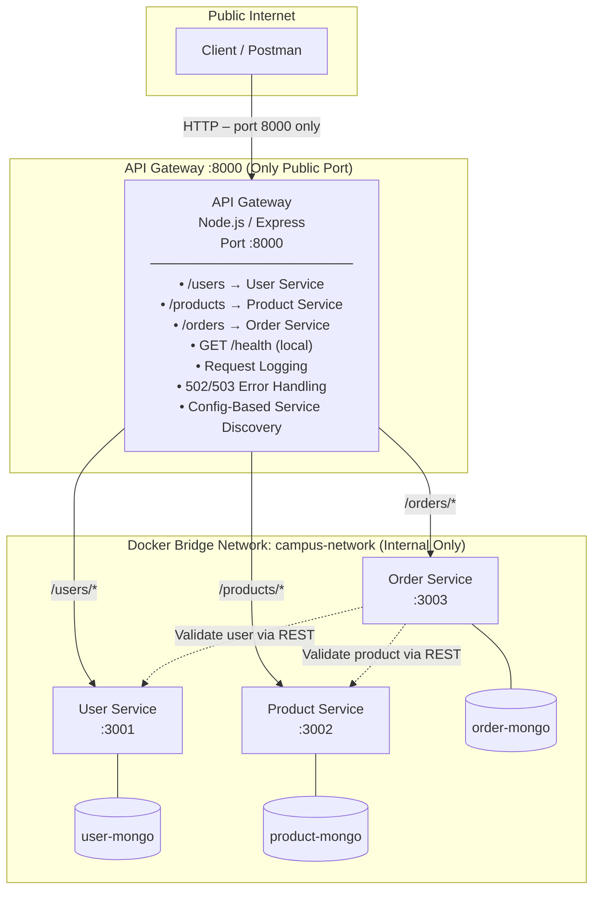

# CampusConnect - Lab 7: API Gateway, Service Discovery & Cloud Deployment

Web Services &amp; SOA Laboratory &bull; Lab 7 &bull; API Gateway &bull; Service Discovery &bull; Cloud Deployment

This lab builds directly on Lab 6's microservices decomposition by introducing a **real API Gateway** as the single entry point, externalizing service locations into configuration-driven **service discovery**, and providing a **cloud deployment blueprint** for hosting the containerized system publicly on the internet.

---

## 1. System Architecture

```
Client / Postman
       │
       ▼ (Public Internet – only port 8000)
┌──────────────────────────────────────────────────────────────────────┐
│  API Gateway  :8000                                                    │
│  ┌──────────────────────────────────────────────────────────────┐    │
│  │  • Route:  /users/*    → User Service                        │    │
│  │  • Route:  /products/* → Product Service                     │    │
│  │  • Route:  /orders/*   → Order Service                       │    │
│  │  • GET /health         (local – no proxy)                    │    │
│  │  • Request Logging (method, path, target, status, latency)   │    │
│  │  • Centralized 502/503/504 Error Handling                    │    │
│  │  • Config-based Service Discovery (env vars)                 │    │
│  └──────────────────────────────────────────────────────────────┘    │
└──────────────────────┬─────────────────────────────────────────────-─┘
                       │ (Docker bridge network: campus-network – internal only)
         ┌─────────────┼──────────────┐
         ▼             ▼              ▼
  ┌──────────┐  ┌──────────┐  ┌──────────┐
  │  User    │  │ Product  │  │  Order   │
  │ Service  │  │ Service  │  │ Service  │
  │ :3001    │  │ :3002    │  │ :3003    │
  │ (expose) │  │ (expose) │  │ (expose) │
  └────┬─────┘  └────┬─────┘  └────┬─────┘
       │              │              │  (inter-service calls via Docker DNS)
       ▼              ▼              ▼
  user-mongo    product-mongo   order-mongo
  (userdb)      (productdb)     (orderdb)
     │                │               │
     └──────────── MongoDB Atlas ────-─┘
                  (cloud database)
```



---

## 2. Part A – API Gateway

### Why an API Gateway?

> **Discussion Answer:** Without a gateway, clients must know the address and port of every individual service, tightly coupling them to the internal topology. An API Gateway introduces a **single stable entry point**: clients always call one URL regardless of how many or few services exist internally. It centralizes cross-cutting concerns such as **request logging**, **centralized error handling** (returning clean 502/503 instead of hanging connections), **CORS**, and **authentication** in one place rather than duplicating that logic across every service. The internal service addresses, ports, and structure remain completely hidden from the outside world—services can be added, moved, or scaled without any change to clients.

### Gateway Implementation

| Feature | Implementation |
|---|---|
| **Reverse Proxy** | `http-proxy-middleware v3` (`createProxyMiddleware`) |
| **Routing** | URL-prefix dispatch: `/users/*`, `/products/*`, `/orders/*` |
| **Health Endpoint** | `GET /health` – gateway status, uptime, service registry (no proxy) |
| **Request Logging** | Custom middleware logs method, path, target, status, latency |
| **Error Handling** | `on.error` hook → `503` (ECONNREFUSED), `504` (timeout), `502` (other) |
| **Port Exposure** | Only `8000` is exposed externally; services use Docker `expose:` only |

### Gateway Endpoints

| Gateway Path | Routed To | Example |
|---|---|---|
| `GET /health` | Gateway itself (no proxy) | Health report + service registry |
| `GET /users`, `GET /users/:id` | User Service | `GET /users/101` |
| `POST /users`, `PUT /users/:id`, `DELETE /users/:id` | User Service | `POST /users` |
| `GET /products`, `GET /products/:id` | Product Service | `GET /products/501` |
| `POST /products`, `PUT /products/:id`, `DELETE /products/:id` | Product Service | `POST /products` |
| `GET /orders`, `GET /orders/:id` | Order Service | `GET /orders` |
| `POST /orders` | Order Service | `POST /orders` |

---

## 3. Part B – Service Discovery (Configuration-Based)

### How It Works

Service locations are **never hard-coded** in gateway route-handling code. Instead, they are loaded at startup from environment variables via a dedicated [`config/serviceRegistry.js`](./api-gateway/config/serviceRegistry.js) module:

```js
// api-gateway/config/serviceRegistry.js
function loadServiceRegistry() {
  return {
    user:    { name: "User Service",    prefix: "/users",    url: process.env.USER_SERVICE_URL    || "http://localhost:3001" },
    product: { name: "Product Service", prefix: "/products", url: process.env.PRODUCT_SERVICE_URL || "http://localhost:3002" },
    order:   { name: "Order Service",   prefix: "/orders",   url: process.env.ORDER_SERVICE_URL   || "http://localhost:3003" }
  };
}
```

The gateway reads this at startup and builds its proxy routing table dynamically—route-handling code references only config values.

### Environment Variables (Service Registry)

| Variable | Docker Compose Value | Cloud Value |
|---|---|---|
| `USER_SERVICE_URL` | `http://user-service:3001` | `https://campusconnect-user-service.onrender.com` |
| `PRODUCT_SERVICE_URL` | `http://product-service:3002` | `https://campusconnect-product-service.onrender.com` |
| `ORDER_SERVICE_URL` | `http://order-service:3003` | `https://campusconnect-order-service.onrender.com` |

### Proof: Config Change Without Code Change

Run `scripts/verify_service_discovery.js` to demonstrate that redirecting the gateway to a migrated service location requires **only changing an environment variable**:

```bash
node scripts/verify_service_discovery.js
# Output:
# [Proof Step 2] Launching API Gateway with config: USER_SERVICE_URL=http://localhost:4001
# [Service Discovery] Registering route: /users/* -> http://localhost:4001 (User Service)
# [Proof Step 4] Response received via Gateway! HTTP Status: 200
# >>> SUCCESS: SERVICE DISCOVERY VERIFICATION PASSED! <<<
```

### Static vs. Dynamic Service Discovery

| Aspect | Static (This Lab) | Dynamic (Consul, Eureka, K8s DNS) |
|---|---|---|
| **Location storage** | Environment variables / config file | Registry service or DNS with health-aware records |
| **Updates require** | Container restart / redeploy | Zero downtime; registry auto-updated |
| **Health awareness** | None – gateway blindly routes | Registry removes unhealthy instances automatically |
| **Scaling** | Manual env-var update per instance | Auto-discovered; load-balanced natively |
| **Complexity** | Minimal – just env vars | Requires Consul/Eureka cluster or K8s |

> A **static config** works well for a handful of stable services, but **dynamic registries** are essential when services start, stop, scale, or migrate frequently (e.g., autoscaling on K8s). Dynamic discovery adds real-time health checking and zero-config routing for new service instances.

---

## 4. Part C – Cloud Deployment

### Deployment Target: Render.com

Render is chosen for its native Docker support, free-tier web services, **private services** (internal network only), and environment variable management via dashboard.

### Deployment Architecture on Render

```
Internet → campusconnect-api-gateway (Web Service, Public URL) :8000
                 │
         Render Private Network
         ┌───────┴───────────────┐
         ▼                       ▼                     ▼
campusconnect-user-service  campusconnect-product-service  campusconnect-order-service
(Private Service, no public URL)   (Private Service)           (Private Service)
         │                       │                     │
         └──────────── MongoDB Atlas ──────────────────┘
```

### Deployment Steps

#### Step 1 – Push to GitHub
```bash
# In d:\Downloads\Lab-6\Lab-6
git init
git add .
git commit -m "Lab 7: API Gateway + Service Discovery + Cloud Deployment"
git remote add origin https://github.com/<your-username>/campusconnect-lab7.git
git push -u origin main
```

#### Step 2 – Create Services on Render

1. Go to [render.com](https://render.com) → **New → Blueprint** → connect your GitHub repo
2. Render will auto-detect `render.yaml` and create all 4 services
3. Set each **private service's** `MONGODB_URI` in Render Dashboard:
   - `campusconnect-user-service` → Env Vars → Add `MONGODB_URI` = your Atlas URI
   - `campusconnect-product-service` → same
   - `campusconnect-order-service` → same

#### Step 3 – Environment Variables for Cloud

For the **API Gateway**, Render auto-injects internal private service URLs. Alternatively set manually:

| Service | Env Var | Value |
|---|---|---|
| `api-gateway` | `USER_SERVICE_URL` | `http://campusconnect-user-service:3001` (Render internal) |
| `api-gateway` | `PRODUCT_SERVICE_URL` | `http://campusconnect-product-service:3002` |
| `api-gateway` | `ORDER_SERVICE_URL` | `http://campusconnect-order-service:3003` |

#### Step 4 – Public Gateway URL

After deployment, the API Gateway public URL will be:
```
https://campusconnect-api-gateway.onrender.com
```

Update Postman's `baseUrl` variable:
```
https://campusconnect-api-gateway.onrender.com
```

#### Alternative: Docker Compose on VPS (AWS/GCP/Azure Free Tier)

```bash
# On a cloud VM:
git clone https://github.com/<your-username>/campusconnect-lab7.git
cd campusconnect-lab7

# Set MongoDB Atlas connection string
export MONGODB_URI="mongodb+srv://<user>:<pass>@cluster.mongodb.net"

# Update .env files with Atlas URI and start
docker compose up -d --build

# Gateway will be publicly accessible at:
# http://<VM_PUBLIC_IP>:8000
```

---

## 5. Local Development Setup

### Quick Start with Docker Compose

```bash
cd d:\Downloads\Lab-6\Lab-6

# Start all services including the API Gateway
docker compose up -d --build

# Verify all containers are running
docker compose ps

# View gateway + service logs
docker compose logs -f api-gateway
docker compose logs -f user-service product-service order-service
```

**All requests go through the gateway only:**
```
http://localhost:8000/health     → Gateway health check
http://localhost:8000/users      → User Service (proxied)
http://localhost:8000/products   → Product Service (proxied)
http://localhost:8000/orders     → Order Service (proxied)
```

Internal services are **not reachable** from outside Docker:
- ~~`http://localhost:3001`~~ → Connection refused (port not exposed)
- ~~`http://localhost:3002`~~ → Connection refused
- ~~`http://localhost:3003`~~ → Connection refused

### Running Without Docker (Local Node.js Testing)

```bash
# Terminal 1: Start test microservices + gateway together
node scripts/start_local_microservices.js

# Or run the full automated test suite:
node scripts/run_gateway_tests.js

# Or verify service discovery config proof:
node scripts/verify_service_discovery.js
```

---

## 6. Postman Testing Workflow

Import `postman_collection.json` into Postman (**Microservices & API Gateway - Lab 7**).

### Test Sequence (all via Gateway port 8000)

| Step | Action | Expected Status | Evidence |
|---|---|---|---|
| **1** | `GET http://localhost:8000/health` | `200 OK` | Gateway status, uptime, service registry |
| **2** | `POST http://localhost:8000/users` | `201 Created` | Save `_id` as `userId` variable |
| **3** | `POST http://localhost:8000/products` | `201 Created` | Save `_id` as `productId` variable |
| **4** | `GET http://localhost:8000/users` | `200 OK` | Routed by gateway to User Service |
| **5** | `GET http://localhost:8000/products` | `200 OK` | Routed by gateway to Product Service |
| **6** | `POST http://localhost:8000/orders` | `201 Created` | Full gateway→order→user+product chain |
| **7** | `GET http://localhost:8000/orders/:id` | `200 OK` | Verifies order with total |
| **8** | `GET http://localhost:8000/users/000000000000000000000000` | `404 Not Found` | Gateway passes 404 from User Service |
| **9** | Stop user-service: `docker compose stop user-service`<br>then `GET http://localhost:8000/users` | `503 Service Unavailable` | Gateway centralized error payload |
| **10** | Restart: `docker compose start user-service`<br>then `GET http://localhost:8000/users` | `200 OK` | Self-healing / recovery |
| **11** | Change `baseUrl` to public cloud URL, re-run all | Same statuses | Cloud deployment verification |

### Automated Test Results (13/13 Passed)

Run `node scripts/run_gateway_tests.js` — all 13 gateway tests pass:

```
[PASS] 1.  Gateway Health Check (GET /health)                (194ms)
[PASS] 2.  Gateway Metadata (GET /)                          (12ms)
[PASS] 3.  User Service: List Users (GET /users)             (111ms)
[PASS] 4.  User Service: Create User (POST /users)           (25ms)
[PASS] 5.  User Service: Get User by ID (GET /users/:id)     (22ms)
[PASS] 6.  Product Service: List Products (GET /products)    (19ms)
[PASS] 7.  Product Service: Create Product (POST /products)  (20ms)
[PASS] 8.  Product Service: Get Product by ID               (17ms)
[PASS] 9.  Order Service: Create Order with Validation       (22ms)
[PASS] 10. Order Service: Fetch Order by ID                  (18ms)
[PASS] 11. Error Handling: Invalid ID (404)                  (19ms)
[PASS] 12. Fault Tolerance: Service Down → 503               (24ms)
[PASS] 13. Self-Healing: Restart → Recovery (200)            (21ms)
ALL 13/13 TESTS PASSED SUCCESSFULLY!
```

---

## 7. File Structure

```
Lab-6/
├── api-gateway/                    # NEW: Lab 7 API Gateway
│   ├── config/
│   │   └── serviceRegistry.js      # Part B: Config-based service discovery
│   ├── server.js                   # Gateway entry point (routing, logging, error handling)
│   ├── Dockerfile                  # Gateway container
│   ├── package.json
│   ├── .env                        # Local development defaults
│   └── .env.example
│
├── user-service/                   # Lab 6 service (unchanged)
├── product-service/                # Lab 6 service (unchanged)
├── order-service/                  # Lab 6 service (unchanged)
│
├── scripts/
│   ├── start_local_microservices.js     # Local test bed (no Docker needed)
│   ├── run_gateway_tests.js             # 13-test automated suite
│   └── verify_service_discovery.js      # Part B config-change proof
│
├── compose.yaml                    # Updated: gateway added, services internal-only
├── render.yaml                     # Part C: Render cloud deployment blueprint
├── postman_collection.json         # Updated: gateway-routed requests
└── README.md                       # This file
```

---

## 8. Reflection (5-8 lines)

Adding the API Gateway and deploying to the cloud fundamentally changed how this system is **used** and **operated**. In Lab 6, clients needed to know the addresses of three separate services and direct calls to the correct port—tight coupling that would break if a service moved or was scaled. With the gateway, clients interact with a **single stable URL**, completely unaware of the internal structure. Operationally, centralizing logging and error handling at the gateway means request traces and failure diagnostics appear in one place rather than across three separate logs. The 502/503 responses are now structured, predictable, and actionable rather than raw connection errors. Deploying to the cloud made the service **reachable over the internet** without any client-side VPN or port-forwarding configuration. The configuration-driven service registry showed how service migrations (port or host changes) can be absorbed at the infrastructure level without touching application code—a foundational pattern that scales naturally toward dynamic registries like Consul or Kubernetes DNS.

---

## 9. Troubleshooting

| Issue | Cause | Fix |
|---|---|---|
| **Gateway 503 on all routes** | Microservice containers not started | Run `docker compose up -d` and wait for all services |
| **Port 8000 conflict** | Another process using port | Change `PORT` env var in `api-gateway/.env` |
| **Gateway container won't start** | Missing env vars or `depends_on` order | Check `docker compose logs api-gateway` |
| **Services still reachable on 3001-3003** | Old compose.yaml with `ports:` | Ensure services use `expose:` not `ports:` in compose.yaml |
| **Cloud: 502 Bad Gateway** | Private services not running | Check Render dashboard for build logs |
| **Cloud: Slow first response** | Render free tier cold start | Wait 30-60 seconds after deploying |
| **Order POST 404** | User/Product IDs not seeded | Create user and product first, copy IDs to order payload |

---

## 10. Lab 6 Architecture Differences

| Aspect | Lab 6 | Lab 7 |
|---|---|---|
| **Entry Point** | 3 separate service ports (3001/3002/3003) | 1 gateway port (8000) |
| **Client knowledge** | Must know all 3 service URLs | Single public URL only |
| **Error handling** | Per-service (inconsistent) | Centralized at gateway (consistent 502/503) |
| **Request logging** | Per-service | Unified gateway log |
| **Service locations** | Hardcoded in order-service only | Externalized config for all routing |
| **Docker ports exposed** | All 3 services (`ports:`) | Only gateway (`ports:`) |
| **Cloud reachable** | localhost only | Public internet URL |